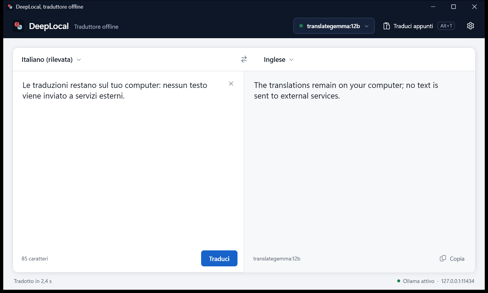
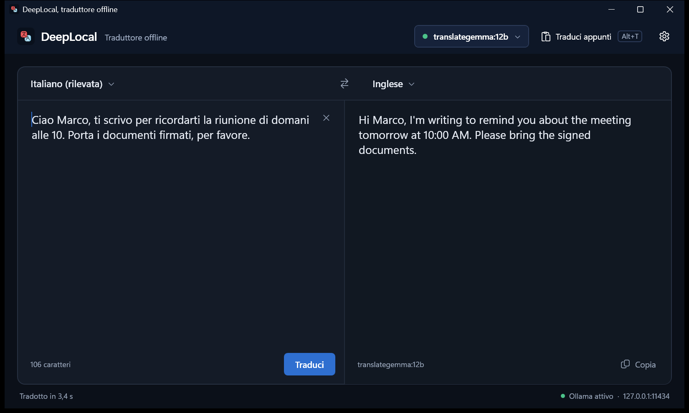

# DeepLocal, Offline Translator (WPF + Ollama)

### DeepLocal brings the DeepL workflow to Windows, fully offline. Your text never leaves your PC: translations run on local models served by Ollama, with TranslateGemma 12B as the default.



# ✨ What's new in 2.0

## Improvements

### Interface

- New DeepL-style layout: language bar above two joined panes, swap button in the middle, large readable text.
- Light and dark theme that follows Windows and switches live; the title bar matches the navy header on Windows 11.
- Interface in English or Italian, chosen by the installer and switchable in Settings without restarting.
- Vector icons instead of emoji, thin scrollbars, keyboard focus rings, character counter, "Copied" feedback on the Copy button.
- Clear errors with a button that fixes them: "Start Ollama", "Retry", "Open model menu" instead of HTTP codes.
- Ollama status always visible (green or red dot) next to the model name and in the status bar.

### Models

- TranslateGemma 12B is the default model, prompted with its official translation format.
- The model menu lists every model installed in Ollama, read live: local models first, cloud models labelled "Cloud", embedding models hidden.
- If TranslateGemma 12B is missing, the menu shows a Download button with progress in MB and percent; downloads can be cancelled and resume later.
- Models that "think" (deepseek-r1, qwen3, gpt-oss) run with thinking off or at minimum, so translations are faster.
- The chosen model is remembered; if it is uninstalled, DeepLocal falls back to TranslateGemma or the first available model and says so.

### Translation

- Translate as you type (can be turned off in Settings), with the text streaming in while the model writes it.
- Stop a translation with Esc or the Stop button; Ctrl+Enter translates immediately.
- "Detect language" stays on and shows what it found, e.g. "Italian (detected)", instead of switching to a fixed language.
- If the text is already in the target language, the target switches automatically (e.g. Italian text, target Italian: translates into English).
- Choosing the same language on both sides swaps them, like DeepL.
- 36 languages (was 9), including Portuguese, Polish, Dutch, Ukrainian, Arabic, Korean and Turkish; right-to-left for Arabic, Hebrew and Persian.
- The swap button also swaps the texts, so the translation becomes the new source.
- Cleaner output: removes quotes, code fences, "Translation:" labels, "END" markers and reasoning blocks some models add.

### Windows integration

- Start with Windows option in Settings and in the installer: DeepLocal starts hidden in the tray, ready for Alt+T.
- Opening DeepLocal a second time brings the running window to the front instead of doing nothing.
- The status bar warns at startup if Alt+T is already taken by another app.
- Self-contained installers in English and Italian: no .NET install needed, they upgrade 1.0 in place and warn if Ollama is missing.
- Settings are saved (model, languages, options) in `%APPDATA%\DeepLocal\settings.json`.

## Bug fixes

- Alt+T after closing the window with X translated in the background but the window stayed minimized and invisible: it now always reappears in front.
- The tray menu kept "Open" disabled after the window was closed with X.
- After the first auto-detection the source switched from "Auto" to the detected language for good, so the next text in another language was labelled wrong.
- Japanese text starting with a kanji was detected as Chinese.
- A detected language returned with punctuation (e.g. "Italian.") was rejected as unsupported.
- Large models or slow first loads failed after 100 seconds (HTTP timeout).
- Errors showed only an HTTP code; Ollama's real message (e.g. "model not found") was lost.
- Pressing Alt+T during a translation started a second one in parallel and the results overwrote each other.
- The 1200x720 window with 480 px minimum columns did not fit laptops with 150% scaling.
- The README promised Portuguese and "Enter to translate", which the code did not do.
- Build output (`bin/`, `obj/`) was not ignored by git.

# 📦 Requirements

- Windows 10 (1809) or Windows 11, 64-bit
- [Ollama](https://ollama.com/download/windows) running at http://127.0.0.1:11434
- About 8 GB of disk for TranslateGemma 12B (downloaded from inside the app)

No .NET install needed: the installer includes the runtime.

# ⬇️ Download

Get the installers from the [Releases](https://github.com/ShinRalexis/DeepLocal/releases) page:

- `DeepLocal_Setup_EN.exe`, English installer and interface
- `DeepLocal_Setup_ITA.exe`, Italian installer and interface

Both upgrade an existing 1.0 installation in place. Verify them with `SHA256SUMS.txt`.
SmartScreen may warn about an unsigned app: click **More info**, then **Run anyway**.

# 🧠 Models

DeepLocal selects `translategemma:12b`. If it is not installed, open the model menu (top right) and click **Download**, or run:

```bash
ollama pull translategemma:12b
```

Any other model installed in Ollama appears in the same menu (gemma3, aya-expanse, mistral, qwen3, gpt-oss...). Cloud models (`*-cloud`) work too, after `ollama signin`, and are marked **Cloud**.

# ⌨️ Shortcuts

| Keys | Action |
|---|---|
| Alt+T | Translate the clipboard, from any app |
| Ctrl+Enter | Translate now |
| Esc | Stop the translation |
| Click on the tray icon | Show the window |
| Right click on the tray icon | Open, translate clipboard, hide, exit |

Closing or minimizing the window keeps DeepLocal in the tray, ready for Alt+T.

# 🧑‍💻 Build from source

```bash
git clone https://github.com/ShinRalexis/DeepLocal.git
cd DeepLocal
dotnet run
```

Requires the .NET 8 SDK. To build both installers (needs [Inno Setup 6](https://jrsoftware.org/isinfo.php)):

```powershell
powershell -ExecutionPolicy Bypass -File installer\build.ps1
```

Project layout:

```text
App.xaml(.cs)          tray, single instance, startup
MainWindow.xaml(.cs)   the translator window
Services/              Ollama client, prompts and language detection, settings, UI strings (IT/EN), theme
Themes/                Light.xaml, Dark.xaml (colours), Controls.xaml (styles)
installer/             Inno Setup script and build script
docs/                  PRODUCT.md, DESIGN.md, screenshots
```

# 🐞 Troubleshooting

- **"Ollama is not responding"**: start Ollama (the error panel has a button for it) and click Retry.
- **Model not found**: download it from the model menu, or `ollama pull <model>`.
- **Alt+T does nothing**: another app uses the same shortcut; the status bar says so at startup. Use the Translate clipboard button.
- **Window not visible**: click the tray icon.

# 🤝 Contributing

Fork, create a `feat/feature-name` branch, keep the XAML style consistent (colours in `Themes/`, texts in `Services/Loc.cs`), and open a PR with a description and screenshots.

# 📣 Support & Donations

If DeepLocal helps you, even $1 is a "hey friend, thanks!" ❤️

Liberapay: https://liberapay.com/MetaDarko/donate

Bitcoin: [1NjV2CfyLw42Ej9UmZEcroyqnmmKMJNCUx](https://www.blockchain.com/explorer/addresses/btc/1NjV2CfyLw42Ej9UmZEcroyqnmmKMJNCUx)

@MetaDarko: https://github.com/ShinRalexis

For bugs or ideas open an Issue with app version, Windows version, steps and screenshots.

# 📝 Licenses

Code (MIT)
Copyright © 2025-2026 MetaDarko.
Permission is hereby granted, free of charge, to any person obtaining a copy of this software and associated documentation files (the "Software"), to deal in the Software without restriction, including without limitation the rights to use, copy, modify, merge, publish, distribute, sublicense, and/or sell copies of the Software, and to permit persons to whom the Software is furnished to do so, subject to the following conditions: the above copyright notice and this permission notice shall be included in all copies or substantial portions of the Software.
THE SOFTWARE IS PROVIDED "AS IS", WITHOUT WARRANTY OF ANY KIND, EXPRESS OR IMPLIED.

Images/Assets (CC BY 4.0)
The screenshots in /docs and the other graphic assets are © 2025-2026 MetaDarko and distributed under Creative Commons Attribution 4.0 International: you may use them freely, including commercially, provided that you attribute "MetaDarko DeepLocal" and indicate any changes.
Full text: https://creativecommons.org/licenses/by/4.0/

In short: the rights remain yours, but anyone can freely use the code and images (with attribution for assets).

TranslateGemma is a Google model distributed under the Gemma Terms of Use. DeepLocal is an independent project and is not affiliated with DeepL SE.
